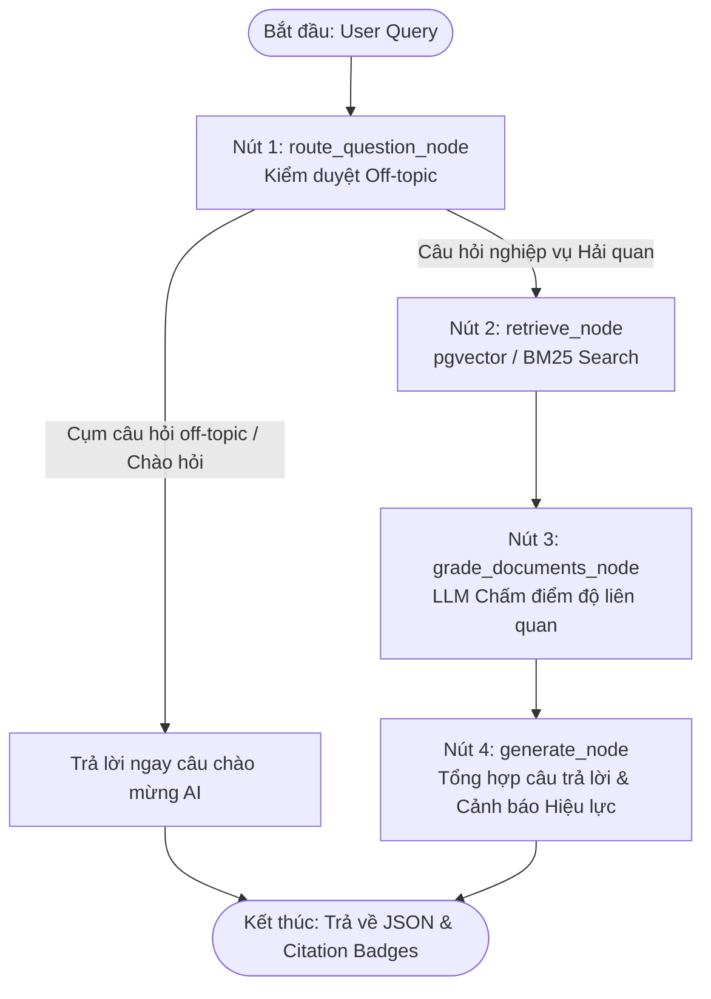

# 📜 Trợ Lý AI Hỏi - Đáp Văn Bản Pháp Luật Hải Quan Việt Nam (Agentic RAG)

Hệ thống Full-stack Chatbot tư vấn thủ tục Hải quan Việt Nam xây dựng trên kiến trúc **Agentic Corrective RAG (LangGraph)**, kết hợp cơ sở dữ liệu quan hệ **PostgreSQL (SQL)**, **pgvector** cho tìm kiếm tương đồng vector và bộ tìm kiếm từ vựng **BM25**.

---

## 🏛️ Kiến Trúc Hệ Thống & Luồng Xử Lý (End-to-End Flow)

### 1. Sơ đồ Luồng Đồ Thị LangGraph (Agentic Graph Workflow)



---

## 🔄 Chi Tiết Luồng Dữ Liệu & Các Nút Đồ Thị (Detailed Workflow Steps)

### 🔹 Giai đoạn 1: Nạp & Tiền xử lý dữ liệu (Data Ingestion Pipeline)
1. **Trích xuất File Word (.doc/.docx):** Hàm `extract_text_from_file` tự động đọc các file văn bản pháp luật thực tế trong `data/raw/` (Luật 54/2014, NĐ 08/2015, NĐ 128/2020, NĐ 169/2026, TT 33/2023, TT 38/2015, TT 121/2025...).
2. **Phân tách Điều / Khoản:** Hàm `parse_articles_from_text` dùng regex nhận diện cấu trúc `Điều X. Tiêu đề` và chia nhỏ thành từng chunk pháp lý độc lập.
3. **Gắn Metadata & Trạng thái Hiệu lực:** Mỗi Điều khoản được gắn metadata số hiệu, ngày ban hành, trạng thái hiệu lực (`con_hieu_luc` / `bi_thay_the`), và văn bản thay thế (`superseded_by`).
4. **Embedding & Lưu DB (Idempotency):** Tính toán Vector Embedding 3072 chiều và nạp đồng thời vào PostgreSQL SQL (`legal_documents`, `legal_articles`) & pgvector (`customs_docs`). Pipeline tự động kiểm tra trùng lặp để chỉ nạp dữ liệu mới.

---

### 🔹 Giai đoạn 2: Xử lý Câu hỏi & Điều phối Đồ thị LangGraph (LangGraph Nodes)

#### 1️⃣ **`route_question_node` (Off-topic Guard - Chặn sớm)**
- **Nhiệm vụ:** Kiểm tra xem câu hỏi có thuộc phạm vi hải quan / xuất nhập khẩu / pháp luật không (`is_customs_query`).
- **Xử lý:**
  - Nếu là câu chào hỏi hoặc lạc đề (VD: *"Bạn là ai?"*, *"Thời tiết hôm nay thế nào?"*), nút trả về ngay câu phản hồi lịch sự giới thiệu trợ lý AI, **ngắt luồng sớm** không cần qua CSDL hay LLM ➔ Tiết kiệm chi phí & thời gian.
  - Nếu là câu hỏi nghiệp vụ hải quan, chuyển sang nút `retrieve_node`.

#### 2️⃣ **`retrieve_node` (Truy hồi dữ liệu Hybrid)**
- **Nhiệm vụ:** Tìm kiếm 3 Điều khoản có độ tương đồng cao nhất với câu hỏi.
- **Xử lý:**
  - **Online Mode:** Sử dụng toán tử Cosine (`<=>`) của pgvector trên PostgreSQL với vector embedding query 3072 chiều.
  - **Offline / Fallback Mode:** Tự động chuyển sang thuật toán **BM25 Lexical Search** thuần Python khi mất mạng hoặc không có Gemini API key.

#### 3️⃣ **`grade_documents_node` (Kiểm duyệt độ liên quan bằng LLM)**
- **Nhiệm vụ:** LLM đóng vai kiểm duyệt viên đánh giá điểm liên quan (`relevance_score` từ 0.0 đến 1.0) của từng tài liệu được truy hồi.
- **Xử lý:**
  - Giữ lại các tài liệu có điểm $\ge 0.7$.

#### 4️⃣ **`generate_node` (Sinh câu trả lời bám ngữ cảnh & Trích dẫn)**
- **Nhiệm vụ:** Tổng hợp câu trả lời tư vấn pháp lý hoàn chỉnh.
- **Quy tắc nghiêm ngặt (Strict Zero-Hallucination Prompt):**
  1. **Bám sát ngữ cảnh:** Chỉ sử dụng thông tin từ danh sách tài liệu tham khảo được cung cấp bên dưới. Không dùng kiến thức bên ngoài, không tự suy diễn.
  2. **Trích dẫn bắt buộc:** Phải trích dẫn rõ **[Điều X - Số hiệu văn bản]** (VD: *Theo Điều 24 Luật Hải quan 54/2014/QH13...*).
  3. **Cảnh báo hết hiệu lực:** Tự động phát hiện và hiển thị cảnh báo đỏ (`⚠️ [CẢNH BÁO PHÁP LÝ]: Văn bản 128/2020 đã bị THAY THẾ bởi 169/2026`).
  4. **Không tìm thấy:** Nếu ngữ cảnh không chứa thông tin, trả về nguyên văn: *"Không tìm thấy thông tin phù hợp trong bộ CSDL quy định thủ tục Hải quan Việt Nam."*
- **LLM Routing Cascade (Tự động xoay Model):**
  - Priority 1: **OpenRouter (DeepSeek R1)** (khi có `OPENROUTER_API_KEY`)
  - Priority 2: **Groq Llama 3.3 70B** ➔ Tự động fallback sang **Llama 3.1 8B Instant** nếu chạm rate limit HTTP 429
  - Priority 3: **Google Gemini 2.0 Flash**
  - Priority 4: **Extractive RAG Fallback** (Hoạt động 100% khi mất mạng)

---

### 🔹 Giai đoạn 3: Phản hồi REST API & Render Frontend UI
1. **Lưu lịch sử SQL:** Ghi nhận toàn bộ thông tin cuộc hội thoại (Session ID, Câu hỏi, Câu trả lời, Citations JSON, Search Fallback Flag) vào bảng `conversations` trong PostgreSQL.
2. **Trả về REST API Response:**
   ```json
   {
     "session_id": "session-1783072112789",
     "question": "Hồ sơ hải quan gồm những chứng từ gì?",
     "documents": ["..."],
     "citations": [
       {
         "law_number": "54/2014/QH13",
         "article_number": "Điều 24",
         "title": "Hồ sơ hải quan",
         "status": "con_hieu_luc",
         "superseded_by": null
       }
     ],
     "generation": "Theo Điều 24 Luật Hải quan 54/2014/QH13, hồ sơ hải quan bao gồm..."
   }
   ```
3. **Frontend UI Rendering:**
   - Markdown Formatting tự động.
   - Thêm Citation Badges màu xanh (`con_hieu_luc`) hoặc màu đỏ (`bi_thay_the`).
   - Nút `+` tạo đoạn chat mới, sidebar lưu danh sách lịch sử theo session.
   - Panel Inspector bên phải hiển thị sơ đồ luồng LangGraph đã đi qua (`trajectory`) và danh sách trích đoạn thô.

---

## 📁 Cấu Trúc Thư Mục Dự Án (Clean Architecture)

```text
RAG-LLM/
├── app/                      # Source code chính của ứng dụng Backend & Frontend
│   ├── core/                 # Cấu hình config, exceptions, LangGraph workflow (graph.py)
│   ├── database/             # PostgreSQL connection, ORM models (LegalDocument, LegalArticle...)
│   ├── schemas/              # Pydantic & TypedDict schemas (GraphState...)
│   ├── services/             # Services: llm, vector_store, bm25_retriever, ingest
│   ├── templates/            # HTML/React Frontend Dashboard UI (index.html)
│   └── main.py               # FastAPI App entrypoint
├── data/
│   └── raw/                  # Bộ văn bản pháp luật mẫu (.doc, .docx)
├── notebooks/                # Jupyter Notebooks kiểm tra dữ liệu
│   └── check_data.ipynb      # Interactive data inspection & RAG test
├── scripts/                  # Scripts hỗ trợ (extract_docx.py, ingest.py)
├── specs/                    # Đặc tả luồng RAG & kịch bản BDD (pipeline_spec.md)
├── tests/                    # Unit tests & Trajectory tests (pytest)
│   ├── test_api_endpoints.py
│   ├── test_graph.py
│   └── test_mock_pipeline.py
├── .env.example              # Template cấu hình biến môi trường
├── Dockerfile                # Docker build configuration
├── docker-compose.yml        # Docker Compose service configuration
├── main.py                   # Root runner (uvicorn main:app)
└── README.md                 # Tài liệu hướng dẫn & Flow dự án
```

---

## 📊 Cấu Trúc Dữ Liệu SQL (Database Schema)

Hệ thống lưu trữ dữ liệu pháp lý theo cấu trúc quan hệ phẳng chuẩn:

1. **`legal_documents` (Quản lý Văn bản):**
   - `law_number`: Số hiệu (Luật 54/2014/QH13, NĐ 08/2015/NĐ-CP, NĐ 128/2020/NĐ-CP, NĐ 169/2026/NĐ-CP, TT 38/2015/TT-BTC, TT 33/2023/TT-BTC...).
   - `doc_type`: Loại văn bản (Luật, Nghị định, Thông tư).
   - `status`: Trạng thái hiệu lực (`con_hieu_luc`, `bi_thay_the`).
   - `superseded_by`: Văn bản thay thế (Ví dụ: `128/2020/NĐ-CP` bị thay thế bởi `169/2026/NĐ-CP`).

2. **`legal_articles` & `customs_docs` (Chi tiết Điều / Khoản & Vector):**
   - `law_number`, `article_number` (Điều 16, Điều 24, Điều 29...).
   - `title`, `content` (Nội dung Điều/Khoản).
   - `embedding`: Vector 3072 chiều.

3. **`conversations` (Lịch sử Hội thoại):**
   - `session_id`, `question`, `answer`, `citations_json`, `created_at`.

---

## 🚀 Hướng Dẫn Cài Đặt & Vận Hành

### 1. Khởi động nhanh bằng Docker Compose (Khuyên dùng)

```bash
# Build và khởi động trọn gói PostgreSQL (pgvector) + FastAPI Web App
docker compose up --build -d

# Truy cập Chatbot Dashboard trên trình duyệt
http://localhost:8000
```

### 2. Khởi động Thủ công (Local Development)

```bash
# 1. Tạo môi trường ảo và cài đặt thư viện
python -m venv .venv
source .venv/bin/activate  # Trên Windows: .venv\Scripts\activate
pip install -r requirements.txt

# 2. Tạo biến môi trường .env từ .env.example
cp .env.example .env

# 3. Khởi chạy FastAPI Backend Server (Tự động seed dữ liệu khi khởi động)
python main.py
```

### 3. Kiểm tra Dữ liệu & Unit Tests
```bash
# Chạy bộ test tự động kiểm tra Endpoints, LangGraph Trajectory & Citation Schema
pytest tests/ -v
```

---

## ⚡ Tính Năng Nổi Bật

- **Zero-Downtime Offline Fallback:** Tự động chuyển sang BM25 Lexical Search & Extractive RAG khi mất kết nối Internet.
- **Anti-Hallucination Guardrails:** Ép buộc LLM chỉ trả lời dựa trên tài liệu CSDL và trả về *"Không tìm thấy..."* nếu không có thông tin.
- **Smart Law Version Control:** Tự động đưa ra cảnh báo khi người dùng tra cứu tài liệu đã bị thay thế bởi văn bản mới.
- **Model Fallback Cascade:** Tự động điều hướng giữa OpenRouter DeepSeek R1, Groq Llama 3.3 70B, Groq Llama 3.1 8B và Gemini 2.0 Flash để tránh lỗi rớt API hoặc nghẽn Rate Limit.

---

## ⚠️ Hạn Chế & Hướng Phát Triển

### Hạn chế hiện tại
- Tốc độ nạp dữ liệu từ các file PDF dung lượng cực lớn (như Danh mục mã HS 31/2022/TT-BTC) phụ thuộc vào RAM máy chủ.
- Xử lý bảng biểu phức tạp trong file Word/PDF dạng image scan cần tích hợp thêm OCR.

### Hướng phát triển
- Tích hợp HyDE (Hypothetical Document Embeddings) và Reranker (Cohere/BGE) để tối ưu hóa độ chính xác retrieval.
- Mở rộng hỗ trợ tra cứu mã HS code theo thời gian thực kết hợp AI Auto-classification.
