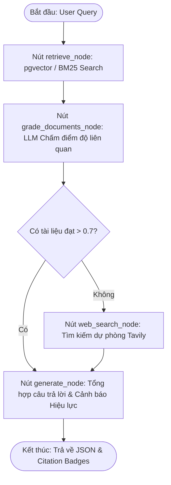

# 📜 Trợ Lý AI Hỏi - Đáp Văn Bản Pháp Luật Hải Quan Việt Nam (Agentic RAG)

Ứng dụng Full-stack Chatbot tư vấn thủ tục Hải quan Việt Nam xây dựng trên kiến trúc **Agentic Corrective RAG (LangGraph)**, kết hợp cơ sở dữ liệu quan hệ **PostgreSQL (SQL)** và **pgvector** cho tìm kiếm tương đồng vector.

---

## 🏛️ Kiến Trúc Hệ Thống & Công Nghệ Sử Dụng

### 1. Công nghệ Lõi (Tech Stack)
- **Backend:** FastAPI (lập trình bất đồng bộ `async`/`await` tránh nghẽn Event Loop).
- **Cơ sở dữ liệu (SQL):** PostgreSQL tích hợp extension `pgvector` phục vụ Cosine Similarity Search (`<=>`).
- **AI Framework & Orchestration:** LangChain kết hợp LangGraph điều phối luồng đồ thị tự kiểm duyệt (Corrective RAG).
- **LLM Routing:** 
  - *Online Mode:* Google Gemini Flash (Model Grader & Generator).
  - *Offline Fallback Mode:* BM25 Lexical Retriever + Extractive RAG (hoạt động 100% không cần Internet/API Key).
- **Frontend:** React SPA Dashboard (Single Page Application) tích hợp sẵn Markdown Renderer, Citation Badges & Inspector Graph Trajectory.

### 2. Sơ đồ Luồng Đồ Thị LangGraph (Agentic Graph Workflow)



---

## 📁 Cấu Trúc Thư Mục Dự Án (Clean Architecture)

```text
RAG-LLM/
├── app/                      # Source code chính của ứng dụng Backend & Frontend
│   ├── core/                 # Cấu hình config, exceptions, LangGraph workflow (graph.py)
│   ├── database/             # PostgreSQL connection, ORM models (LegalDocument, LegalArticle...)
│   ├── schemas/              # Pydantic & TypedDict schemas (GraphState...)
│   ├── services/             # Services: llm, vector_store, web_search, bm25_retriever, ingest
│   ├── templates/            # HTML/React Frontend Dashboard UI (index.html)
│   └── main.py               # FastAPI App entrypoint
├── data/
│   └── raw/                  # Bộ văn bản pháp luật mẫu (.doc, .pdf)
├── notebooks/                # Jupyter Notebooks kiểm tra dữ liệu
│   └── check_data.ipynb      # Interactive data inspection & RAG test
├── scripts/                  # Scripts hỗ trợ (extract_docx.py, ingest.py)
├── specs/                    # Đặc tả luồng RAG & kịch bản BDD (pipeline_spec.md)
├── tests/                    # Unit tests & Trajectory tests (pytest)
│   ├── test_api_endpoints.py
│   ├── test_graph.py
│   └── test_mock_pipeline.py
├── .env.example              # Template cấu hình biến môi trường
├── Dockerfile                # Docker build configuration
├── docker-compose.yml        # Docker Compose service configuration
├── main.py                   # Root runner (uvicorn main:app)
└── README.md                 # Tài liệu hướng dẫn dự án
```

---

## 📊 Cấu Trúc Dữ Liệu SQL (Database Schema)

Hệ thống lưu trữ dữ liệu pháp lý theo cấu trúc quan hệ phẳng chuẩn:

1. **`legal_documents` (Quản lý Văn bản):**
   - `law_number`: Số hiệu (Luật 54/2014/QH13, NĐ 08/2015/NĐ-CP, NĐ 128/2020/NĐ-CP, NĐ 169/2026/NĐ-CP, TT 38/2015/TT-BTC, TT 33/2023/TT-BTC...).
   - `doc_type`: Loại văn bản (Luật, Nghị định, Thông tư).
   - `status`: Trạng thái hiệu lực (`con_hieu_luc`, `bi_thay_the`).
   - `superseded_by`: Văn bản thay thế liên quan (Ví dụ: `128/2020/NĐ-CP` bị thay thế bởi `169/2026/NĐ-CP`).

2. **`legal_articles` & `customs_docs` (Chi tiết Điều / Khoản & Vector):**
   - `law_number`, `article_number` (Điều 16, Điều 29, Điều 24...).
   - `title`, `content` (Nội dung Điều/Khoản).
   - `embedding`: Vector 3072 chiều.

3. **`conversations` (Lịch sử Hội thoại):**
   - `session_id`, `question`, `answer`, `citations_json`, `created_at`.

---

## 🚀 Hướng Dẫn Cài Đặt & Chạy Ứng Dụng

### 1. Khởi động nhanh bằng Docker Compose (Khuyên dùng cho Demo)

```bash
# 1. Build và khởi động trọn gói PostgreSQL (pgvector) + FastAPI Web App
docker compose up --build -d

# 2. Mở trình duyệt truy cập Chatbot Dashboard
http://localhost:8000
```

### 2. Khởi động Thủ công (Local Development)

```bash
# 1. Tạo môi trường ảo và cài đặt thư viện
python -m venv .venv
source .venv/bin/activate  # Trên Windows: .venv\Scripts\activate
pip install -r requirements.txt

# 2. Nạp dữ liệu văn bản Hải quan vào PostgreSQL & pgvector
python ingest.py

# 3. Khởi chạy FastAPI Backend Server
python main.py
```

### 3. Kiểm tra Dữ liệu bằng Jupyter Notebook
Mở file `check_data.ipynb` bằng VS Code / Jupyter Lab để xem trực tiếp các Điều/Khoản đã nạp và chạy thử luồng retrieval.

---

## 🧪 Chạy Kiểm Thử Tự Động (Pytest & Trajectory Evaluation)

```bash
# Trực tiếp chạy bộ kiểm thử Trajectory & REST API Schema
pytest tests/ -v
```

---

## ⚡ Chế Độ Chạy Offline Fallback (Offline Demo Mode)

Hệ thống được thiết kế **Zero-Downtime Guarantee**: Khi mất kết nối Internet hoặc không nhập `GOOGLE_API_KEY`, ứng dụng tự động kích hoạt chế độ **Offline BM25 Lexical Search & Extractive RAG Answer Generator**. Bạn có thể an toàn demo sản phẩm mà không phụ thuộc bất kỳ API bên thứ 3 nào.

---

## ⚠️ Hạn Chế & Hướng Phát Triển

### Hạn chế hiện tại
- Tốc độ nạp dữ liệu từ các file PDF dung lượng cực lớn (như Danh mục mã HS 31/2022/TT-BTC) phụ thuộc vào RAM máy chủ.
- Xử lý bảng biểu phức tạp trong file Word/PDF dạng image scan cần tích hợp thêm OCR.

### Hướng phát triển
- Tích hợp HyDE (Hypothetical Document Embeddings) và Reranker (Cohere/BGE) để tối ưu hóa độ chính xác retrieval.
- Mở rộng hỗ trợ tra cứu mã HS code theo thời gian thực kết hợp AI Auto-classification.
